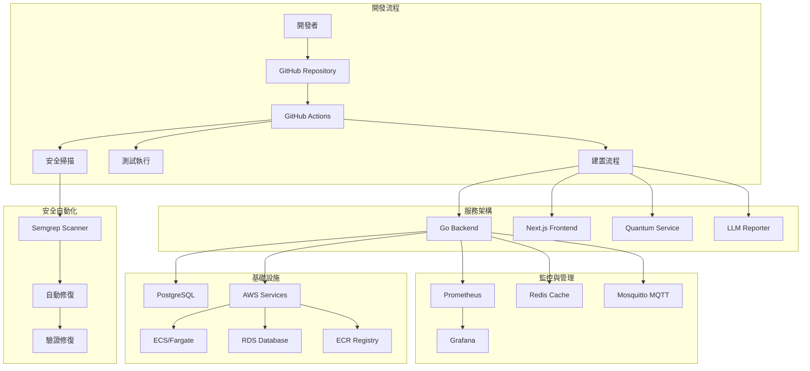

<h1 align="center">資安情報平台 (Security Intelligence Platform)</h1>

<p align="center">
  一個創新、自動化且可擴展的開源資安威脅情報平台。
</p>

<p align="center">
  
  <a href="https://github.com/<your-repo>/blob/main/LICENSE">/security-intel-platform?style=flat-square" alt="License"></a>
  <a href="https://github.com/<your-repo>/issues">/security-intel-platform?style=flat-square" alt="GitHub issues"></a>
  
  
  
  
</p>

> 「資安情報與預測平台」專案的詳細文件，旨在提供一個清晰的概覽、技術細節和實施指南。

<br>

---

## 📖 目錄 (Table of Contents)

- [專案概述](#-專案概述-project-overview)
- [✨ 核心功能](#-核心功能-core-features)
- [🛠️ 技術棧](#️-技術棧-technology-stack)
- [🏗️ 專案結構](#️-專案結構-project-structure)
- [🔒 安全自動化](#-安全自動化-security-automation)
- [🚀 CI/CD 專業分工規劃](#-cicd-專業分工規劃)
- [⚡ 快速入門](#-快速入門-quick-start)
- [🤝 貢獻指南](#-貢獻指南-contributing)
- [📜 授權](#-授權-license)

---

## 📝 專案概述 (Project Overview)

「資安情報平台」是一個創新且自動化的資安威脅情報蒐集與分析平台。我們旨在建立一個易於部署、可擴展的解決方案，幫助個人、研究者乃至組織追蹤、理解並預測不斷演進的資安威脅。本專案將實現多源情報整合、分級存取、多元支付選項，並實驗性地探索前沿技術如大型語言模型 (LLM) 報告生成及量子計算預測零日攻擊的潛力。

<details>
  <summary><strong>💡 補充知識：什麼是資安情報平台 (TIP)？</strong></summary>
  
  > 資安情報平台 (Threat Intelligence Platform, TIP) 是一種用於匯總、分析和分發威脅情報的技術解決方案。它的核心價值在於將來自不同來源（開源、商業、內部）的雜亂數據，轉化為具體、可操作的洞察，幫助組織：
  > 1.  **主動防禦**：在攻擊發生前識別潛在威脅。
  > 2.  **加速應變**：快速了解攻擊者的手法 (TTPs)，縮短調查時間。
  > 3.  **優化決策**：為資安投資和策略提供數據支持。
  >
  > 這個專案的目標就是打造一個現代化、自動化且可擴展的 TIP。
</details>

## ✨ 核心功能 (Core Features)

| 功能分類                                  | 描述                                                                                                                      |
| :---------------------------------------- | :------------------------------------------------------------------------------------------------------------------------ |
| **🤖 自動化情報蒐集**                     | 定期從多個公開來源（如 AbuseIPDB、Have I Been Pwned、NVD/CVE）抓取惡意 IP、漏洞資訊、數據泄露事件等，並進行清洗與正規化。 |
| **🔍 靈活的瀏覽與搜尋**                   | 提供直觀的儀表板與強大的搜尋篩選功能，快速定位特定威脅情報。                                                              |
| **🧩 階層式存取訂閱制**                   | 提供免費層與付費層，以 Freemium 模式滿足不同用戶需求，解鎖更即時、更深入的數據。                                            |
| **💳 多元支付選項**                       | 支援傳統法幣 (透過 Stripe) 與創新的穩定幣支付，提供全球用戶彈性的付款選擇。                                               |
| **✍️ 智慧報告生成 (實驗性)**              | 利用大型語言模型 (LLM) 自動生成情報摘要、分析報告或簡報草稿，提升分析效率。                                               |
| **🔮 量子預測 (概念驗證)**                | 探索在 IBM Quantum Lab 上運行量子演算法，預測潛在的零日攻擊模式。                                                         |
| **🔐 數據泄露監控**                       | 整合 Have I Been Pwned API，監控帳戶泄露、密碼安全性和域名安全狀態。                                                      |
| **🔒 安全自動化**                         | 整合 Semgrep 安全掃描，自動修復常見安全問題，確保程式碼安全性。                                                           |
| **🧩 可擴展與自動化**                     | 基於 Go + Next.js 的微服務友好架構，並透過 Terraform 與 CI/CD 流程實現完全自動化。                                        |

## 🛠️ 技術棧 (Technology Stack)

| 類別                  | 技術                                           | 選擇原因與說明                                                              |
| :-------------------- | :--------------------------------------------- | :-------------------------------------------------------------------------- |
| **後端 (Backend)**    | **Go (Golang)**                                | 高併發性能、靜態類型安全、部署簡單，非常適合網路服務與 API 開發。           |
|                       | Gin Gonic                                      | 一個輕量級、高效能的 Go Web 框架，路由和中介層設計直觀。                    |
| **前端 (Frontend)**   | **Next.js (React)**                            | 提供伺服器端渲染 (SSR) 和 App Router，有利於 SEO 和開發體驗。               |
|                       | Tailwind CSS                                   | Utility-First 的 CSS 框架，能快速建構客製化 UI，且易於維護。                |
| **量子計算**          | **Python + Qiskit**                            | IBM 量子計算框架，支援本地模擬和雲端量子硬體。                             |
| **AI/ML 服務**        | **Python + LLM APIs**                          | 整合大型語言模型，自動生成安全報告和分析。                                 |
| **資料庫 (Database)** | **PostgreSQL**                                 | 功能強大、穩定可靠的開源關聯式資料庫，支援複雜查詢和 JSONB 等多種資料類型。 |
|                       | AWS RDS / OCI Free DB                          | 託管式資料庫服務，簡化了維運、備份和擴展的複雜性。                          |
| **監控與日誌**        | **Prometheus + Grafana**                       | 完整的監控解決方案，提供指標收集和視覺化。                                |
| **訊息佇列**          | **Redis + Mosquitto MQTT**                     | 高效能的快取和即時訊息傳遞。                                               |
| **容器化**            | **Docker + Docker Compose**                    | 標準化的容器化部署，支援多環境配置。                                       |
| **基礎設施 (IaC)**    | **Terraform**                                  | 用程式碼來定義和管理雲端資源，實現可重複、可追蹤的基礎設施部署。            |
| **安全掃描**          | **Semgrep**                                    | 靜態程式碼分析工具，自動檢測和修復安全漏洞。                               |
| **CI/CD**             | **GitHub Actions**                             | 完整的自動化流程，包含程式碼品質檢查、安全掃描和部署。                      |
|                       | Amazon ECR                                     | AWS 託管的 Docker 容器註冊表，安全可靠。                                    |
|                       | Vercel                                         | Next.js 的最佳部署平台，提供全球 CDN 和自動化的 CI/CD 流程。                |

## 🏗️ 專案結構 (Project Structure)

本專案採用現代化的 Monorepo 結構，整合多種技術棧和服務：

```plaintext
siep-microservices-lab/
├── .github/                    # GitHub 相關配置
│   ├── workflows/              # CI/CD 工作流程
│   │   ├── ci.yml             # 主要 CI 流程
│   │   ├── security-auto-fix.yml  # 安全自動修復
│   │   ├── quantum-runner.yml # 量子任務執行器
│   │   ├── quantum-ci.yml     # 量子服務 CI
│   │   └── data-collection.yml # 數據收集排程
│   └── ISSUE_TEMPLATE/        # Issue 模板
├── backend/                   # Go 後端服務 (Clean Architecture)
│   ├── cmd/                   # 應用程式進入點
│   ├── internal/              # 內部包
│   ├── pkg/                   # 可重用包
│   ├── api/                   # API 定義
│   ├── database/              # 資料庫相關
│   ├── scripts/               # 後端腳本
│   ├── Dockerfile            # 後端容器化
│   ├── go.mod                # Go 模組
│   └── Makefile              # 後端建置腳本
├── frontend/                  # Next.js 前端應用 (App Router)
│   ├── src/
│   │   ├── app/              # App Router 頁面
│   │   └── components/       # React 元件
│   ├── public/               # 靜態資源
│   ├── package.json          # 前端依賴
│   └── Dockerfile           # 前端容器化
├── services/                 # 微服務模組
│   ├── quantum-predictor/    # 量子預測服務
│   │   ├── main.py          # 量子服務主程式
│   │   ├── quantum_predictor.py  # 量子預測邏輯
│   │   ├── circuit_designer.py   # 量子電路設計
│   │   ├── tests/           # 量子服務測試
│   │   ├── requirements.txt  # Python 依賴
│   │   └── Dockerfile       # 量子服務容器化
│   └── llm-reporter/        # LLM 報告生成服務
│       ├── app.py           # LLM 服務主程式
│       ├── requirements.txt  # Python 依賴
│       └── Dockerfile       # LLM 服務容器化
├── packages/                 # 共享套件 (Monorepo)
│   ├── api-main/            # API 主套件
│   ├── tsconfig-custom/     # 自定義 TypeScript 配置
│   ├── ui-components/       # 共享 UI 元件
│   └── web-app/             # Web 應用套件
├── quantum-service/          # IBM Quantum Python 模組
│   ├── circuits/            # 量子電路定義
│   ├── tests/               # Python 測試
│   ├── main.py              # 程式主進入點
│   ├── requirements.txt      # Python 依賴項
│   └── Dockerfile           # 量子服務容器化
├── terraform/                # 基礎設施即程式碼 (IaC)
│   ├── environments/        # 環境配置
│   │   ├── dev/            # 開發環境
│   │   └── prod/           # 生產環境
│   ├── modules/            # Terraform 模組
│   │   ├── ecs/            # ECS 服務模組
│   │   ├── rds/            # RDS 資料庫模組
│   │   ├── security/       # 安全組模組
│   │   └── vpc/            # VPC 網路模組
│   └── README.md           # Terraform 說明
├── docker/                  # Docker 相關配置
│   └── Dockerfile          # 多服務 Dockerfile
├── nginx/                   # Nginx 配置
│   ├── nginx.conf          # 主配置
│   └── conf.d/             # 站點配置
├── supervisor/              # 程序管理配置
│   ├── supervisord.conf    # Supervisor 主配置
│   └── conf.d/             # 服務配置
│       ├── postgresql.conf # PostgreSQL 配置
│       ├── redis.conf      # Redis 配置
│       ├── mosquitto.conf  # MQTT 配置
│       ├── prometheus.conf # Prometheus 配置
│       ├── grafana.conf    # Grafana 配置
│       └── backend.conf    # 後端配置
├── grafana/                 # Grafana 配置
│   ├── provisioning-sit/   # 資料來源配置
│   └── dashboards-sit/     # 儀表板配置
├── prometheus/              # Prometheus 配置
│   └── config-sit/         # 監控配置
├── mosquitto/               # MQTT 配置
│   └── config-sit/         # MQTT 服務配置
├── redis/                   # Redis 配置
│   └── redis-sit.conf      # Redis 服務配置
├── database/                # 資料庫相關
│   └── init/               # 初始化腳本
├── scripts/                 # 系統腳本
│   ├── security_auto_fix.py # 安全自動修復
│   ├── test_security_fix.py # 安全修復測試
│   ├── fix-docker-build.sh # Docker 建置修復
│   ├── build-docker.sh     # Docker 建置腳本
│   ├── start-services.sh   # 服務啟動腳本
│   ├── init-services.sh    # 服務初始化
│   ├── init-database.sh    # 資料庫初始化
│   ├── init-redis.sh       # Redis 初始化
│   ├── init-mqtt.sh        # MQTT 初始化
│   ├── init-monitoring.sh  # 監控初始化
│   └── wait-for-it.sh      # 服務等待腳本
├── tests/                   # 測試相關
│   ├── api/                # API 測試
│   ├── config/             # 配置測試
│   └── README.md           # 測試說明
├── tests-e2e/               # 端到端測試
├── notebooks/               # Jupyter Notebooks
├── docs/                    # 專案文件
├── documentation/           # 技術文件
├── infra/                   # 基礎設施配置
├── .github/                 # GitHub 配置
├── .cursor/                 # Cursor IDE 配置
├── backups/                 # 備份檔案
├── docker-compose.dev.yml   # 開發環境 Docker Compose
├── docker-compose.sit.yml   # SIT 環境 Docker Compose
├── docker-compose.prod.yml  # 生產環境 Docker Compose
├── package.json             # 根目錄 package.json
├── turbo.json               # Turborepo 配置
├── Makefile.security        # 安全相關 Makefile
├── env.example              # 環境變數範例
├── vault.env                # Vault 環境變數
├── semgrep-results.json     # Semgrep 掃描結果
├── DOCKER_BUILD_FIX_REPORT.md # Docker 建置修復報告
├── CONTRIBUTING.md          # 貢獻指南
├── CODE_OF_CONDUCT.md       # 行為準則
├── LICENSE                  # 授權文件
└── README.md                # 本文件
```

## 🔒 安全自動化 (Security Automation)

本專案整合了先進的安全自動化工具，確保程式碼和基礎設施的安全性：

### Semgrep 安全掃描
- **自動掃描**: 使用 Semgrep 自動檢測安全問題
- **智能修復**: 自動修復常見的安全配置問題
- **詳細報告**: 生成完整的修復報告
- **備份保護**: 自動備份原始檔案
- **驗證機制**: 修復後自動驗證效果

### 支援修復的問題類型
- **Nginx 配置問題**: 修復安全標頭和 H2C 走私漏洞
- **Dockerfile 安全問題**: 添加非 root 用戶
- **Terraform 安全問題**: 啟用加密、日誌記錄等安全功能

### 使用方式
```bash
# 安裝依賴
pip install semgrep pyyaml requests

# 執行完整修復流程
make -f Makefile.security security-full

# 分步驟執行
make -f Makefile.security security-scan    # 掃描
make -f Makefile.security security-fix     # 修復
make -f Makefile.security security-verify  # 驗證
```

## 🚀 CI/CD 專業分工規劃

本專案採用現代化的 CI/CD 流程，結合多種工具實現專業級的自動化：

### GitHub Actions 工作流程

| 工作流程 | 觸發條件 | 主要功能 |
|---------|---------|---------|
| **ci.yml** | Push/PR | 程式碼品質檢查、單元測試、安全性掃描 |
| **security-auto-fix.yml** | 手動/排程 | 自動修復 Semgrep 發現的安全問題 |
| **quantum-runner.yml** | 排程 | 執行量子計算任務 |
| **quantum-ci.yml** | quantum-service 變更 | 量子服務的 CI/CD |
| **data-collection.yml** | 排程 | 自動化數據收集 |

### 系統架構圖



## 🔐 Have I Been Pwned (HIBP) API 整合

本平台完整整合了 Have I Been Pwned API v3，提供全面的數據泄露監控功能：

### 支援的 HIBP 功能

| 功能類別           | 端點                                          | 描述                                 |
| ------------------ | --------------------------------------------- | ------------------------------------ |
| **帳戶泄露檢查**   | `GET /api/v1/hibp/account/{account}/breaches` | 檢查特定帳戶是否在已知數據泄露事件中 |
| **Paste 記錄查詢** | `GET /api/v1/hibp/account/{account}/pastes`   | 查詢帳戶在 Paste 網站上的記錄        |
| **域名泄露監控**   | `GET /api/v1/hibp/domain/{domain}/breaches`   | 監控特定域名下的郵箱泄露情況         |
| **密碼安全檢查**   | `GET /api/v1/hibp/password/check`             | 檢查密碼是否已被泄露（無需認證）     |
| **泄露事件查詢**   | `GET /api/v1/hibp/breaches`                   | 獲取所有已知的數據泄露事件           |
| **最新泄露事件**   | `GET /api/v1/hibp/breach/latest`              | 獲取最新添加的泄露事件               |
| **Stealer Logs**   | `GET /api/v1/hibp/stealer/*`                  | 查詢竊取器日誌（需要高級訂閱）       |
| **訂閱狀態**       | `GET /api/v1/hibp/subscription/status`        | 查詢 HIBP 訂閱狀態和配額             |

### 前端功能

- **帳戶泄露檢查器**：輸入電子郵件地址檢查是否在泄露事件中
- **密碼安全驗證器**：檢查密碼是否已被泄露
- **域名監控器**：監控特定域名的安全狀態
- **實時安全建議**：根據檢查結果提供個性化安全建議

### 配置要求

在環境變數中設置 HIBP API 金鑰：

```bash
HIBP_API_KEY=your_hibp_api_key_here
```

### 使用範例

```bash
# 檢查帳戶泄露
curl -H "Authorization: Bearer YOUR_JWT_TOKEN" \
     "http://localhost:8080/api/v1/hibp/account/user@example.com/breaches"

# 檢查密碼安全性
curl "http://localhost:8080/api/v1/hibp/password/check?password=yourpassword"

# 檢查域名泄露
curl -H "Authorization: Bearer YOUR_JWT_TOKEN" \
     "http://localhost:8080/api/v1/hibp/domain/example.com/breaches"
```

## ⚡ 快速入門 (Quick Start)

<details>
  <summary><strong>點此展開本地開發環境設置指南</strong></summary>

### 前提條件 (Prerequisites)

- Git, Docker & Docker Compose
- Go (>= 1.22)
- Node.js (>= 18)
- Python (>= 3.10)
- Terraform (>= 1.5)
- AWS CLI (已配置憑證)

### 本地開發環境設置 (Local Development Setup)

1.  **複製儲存庫**：

    ```bash
    git clone [https://github.com/](https://github.com/)<your-repo>/siep-microservices-lab.git
    cd siep-microservices-lab
    ```

2.  **配置環境變數**：

    > ⚠️ **安全警告**：切勿將包含 API Key、資料庫密碼等敏感資訊的 `.env` 檔案提交到 Git 儲存庫！請務必將其加入 `.gitignore` 檔案中。

    參考 `env.example` 來建立你的環境變數文件。

3.  **修復 Docker 建置問題**（如果需要）：

    ```bash
    # 執行 Docker 建置修復腳本
    ./scripts/fix-docker-build.sh
    ```

4.  **啟動依賴服務 (Docker)**：

    ```bash
    # 開發環境
    docker-compose -f docker-compose.dev.yml up -d
    
    # 或 SIT 環境
    docker-compose -f docker-compose.sit.yml up -d
    ```

5.  **運行後端服務** (使用 Makefile)：

    ```bash
    cd backend
    make run
    ```

    > ℹ️ 後端預設會在 `http://localhost:8080` 運行。

6.  **運行前端應用**：

    ```bash
    cd frontend
    npm install
    npm run dev
    ```

    > ℹ️ 前端預設會在 `http://localhost:3000` 運行。

7.  **執行安全掃描**（可選）：

    ```bash
    # 執行安全自動修復
    make -f Makefile.security security-full
    ```

### 服務端口配置

| 服務 | 端口 | 描述 |
|------|------|------|
| Backend API | 8080 | 主要 API 服務 |
| Frontend | 3000 | Next.js 前端應用 |
| PostgreSQL | 5432 | 資料庫服務 |
| Redis | 6379 | 快取服務 |
| MQTT | 1883 | 訊息佇列 |
| Prometheus | 9090 | 監控服務 |
| Grafana | 3001 | 儀表板服務 |

</details>

---

## 🤝 貢獻指南 (Contributing)

我們非常歡迎社群的貢獻！若您有興趣，請參考 `CONTRIBUTING.md` 文件了解詳細的貢獻流程，包括如何提出 Issue 和提交 Pull Request。

請務必遵守我們的 **行為準則 (`CODE_OF_CONDUCT.md`)**。

### 貢獻流程

1. **Fork 專案**
2. **建立功能分支**: `git checkout -b feature/amazing-feature`
3. **提交變更**: `git commit -m 'Add some amazing feature'`
4. **推送到分支**: `git push origin feature/amazing-feature`
5. **開啟 Pull Request**

### 開發指南

- 遵循現有的程式碼風格
- 添加適當的測試
- 更新相關文件
- 確保所有測試通過
- 執行安全掃描檢查

## 📜 授權 (License)

本專案根據 **MIT License** 發佈。詳情請參閱 `LICENSE` 文件。

---

## 📞 支援與聯絡

如果您在使用過程中遇到問題或有任何建議，請：

1. 查看 [Issues](https://github.com/<your-repo>/issues) 頁面
2. 建立新的 Issue 描述問題
3. 參考 `CONTRIBUTING.md` 了解貢獻流程

---

**🎉 感謝您對資安情報平台的關注與支持！**
